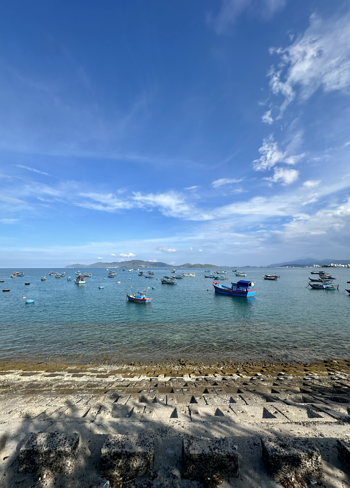
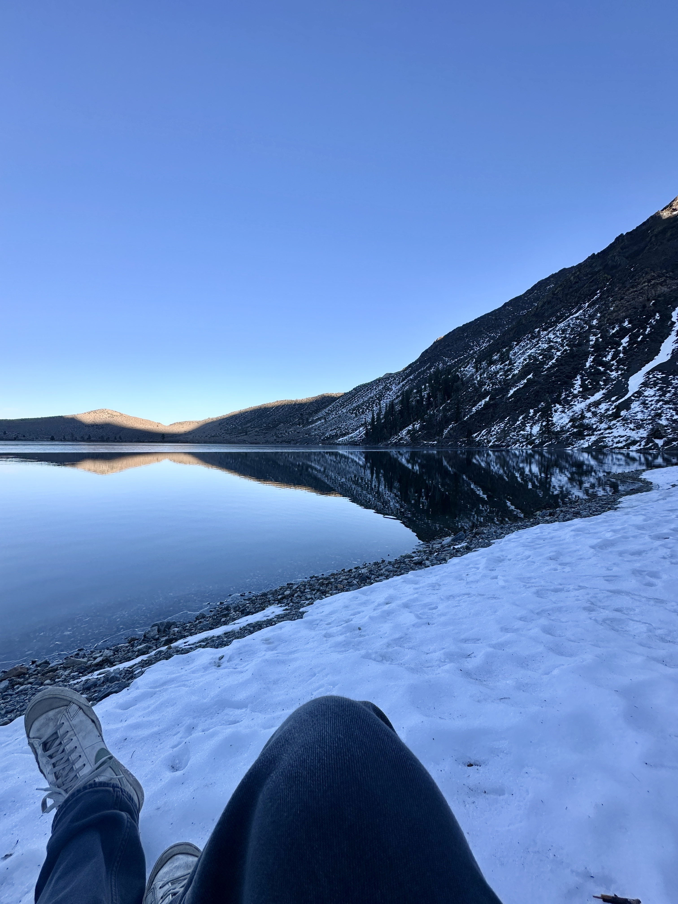
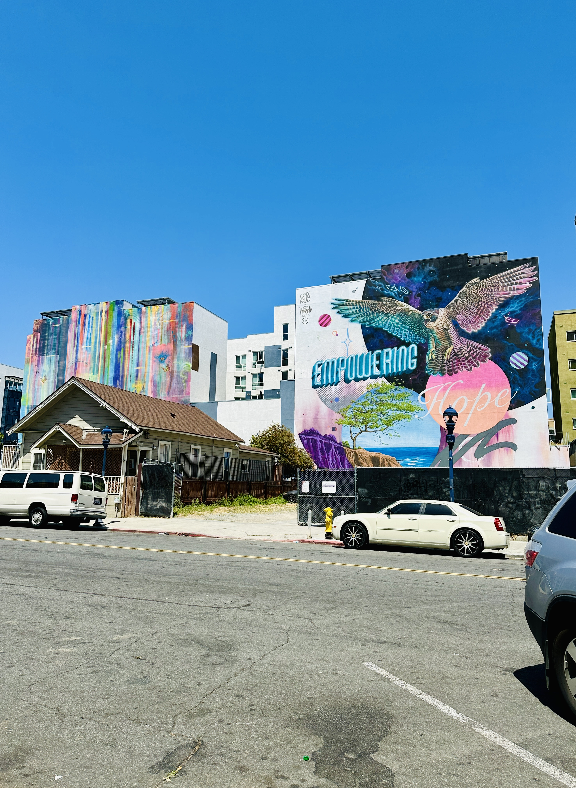
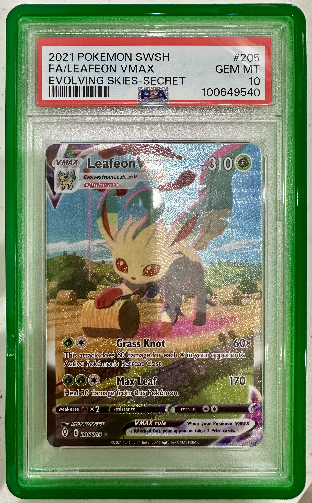
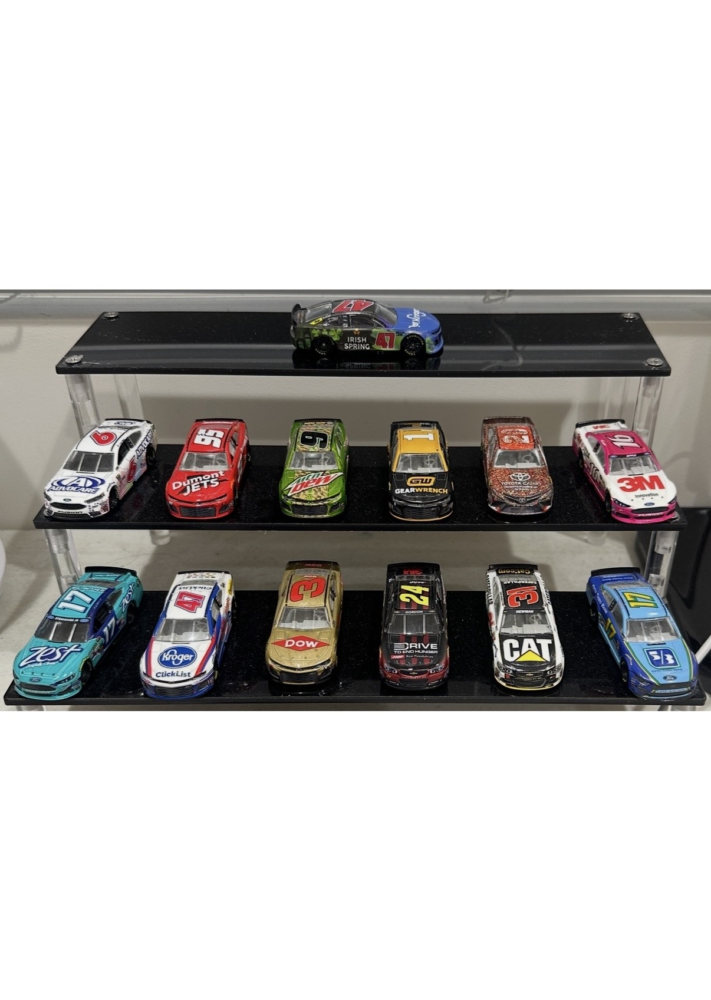

--- 

Before going to college, I had lived all of my life in the Little Saigon area of Orange County, Southern California.  However, I chose to go school, away from home, at UC Santa Barbara due to its outstanding environmental studies program and location/weather.  My current research interests are in pollution remediation, renewable energy, forestry, and environmental challenges of urban communities.

--- 

## Places

My parents use to take my siblings and me to many different places when I was very young, so I had little to no memories of it.  However, we still go to Vietnam every few years during the summer to visit my extended family, which is very fun since I love flying on planes and plane spotting.  Although Vietnam's cities are heavily congested and tourist-dense, the countryside is where I get nostalgic memories since it envelops me in the culture my parents lived in.  

Ever since I began my education at UC Santa Barbara, I have been going on trips to the Sierra Nevadas annually for research or academic-related purposes, which has been a gift in of itself since the region has some of the most spectacular scenery I have ever seen.  I am proud to consider it a second-home at this point since I am very familiar with the area and its natural environment.  

The only place I have been to exactly once every year since 2023 is San Diego, which is uncanny since each visit was for different reasons.  The most memorable trip was when my friends and I rented out an Airbnb in Chula Vista for a five-day weekday hangout after our first year in college.  I can definitely say the city is extremely beautiful and its climate is basically a reflection of what Santa Barbara's is.  

::: {layout="[[1, 1, 1]]"}

 

:::

--- 

## Hobbies

I love to watch motorsports racing, particularly NASCAR, Indycar, and Formula 1 on the weekends.  I remember first getting into watching it around ten years ago on my TV and since then, my knowledge about drivers and cars has only grown.  I have not been to many races but just this past April (2026), I attended the Acura Grand Prix of Long Beach.  

The other main sport I enjoy watching is ice hockey, especially because I have a hometown team, that being the Anaheim Ducks.  I have been watching since 2017 and although my team has not been good up until this year (2026), I enjoy watching almost every game from other teams and like to cheer on my favorite players like Elias Pettersson or Trevor Zegras.  

Things I like to do actively on my own time are mainly cardio-related activities like hiking, running, and biking since I admire the outdoors.  However, a niche thing about me I mentioned briefly earlier is that I love planes in general.  There is just something I love about seeing different kinds of planes/airlines and watching them come/go that gets me excited whenever I do catch them.  

::: {layout="[[1, 1, 1]]"}

:::

--- 

## Collectibles

My favorite thing to collect would have to be trading cards, especially Pokemon cards since I have been collecting them for as long I could remember, which dates back to 2011.  Although I played Pokemon for a very long time, I only began to passionately collect Pokemon cards after the COVID-19 pandemic began.  I am a bit reserved now when it comes to growing my collection due to strict budgeting, but all of my friends know I am more than happy to showcase my collection to other people.

As a fan of motorsports racing, as mentioned before, I do love to collect diecast models (small-scaled cars like HotWheels) as memorabilia of my favorite drivers and cars.  Most of my collection consists of NASCAR stock cars, but I have a decent amount of HotWheels mixed in there as nostalgia and my favorite cars.     

::: {layout="[[1, 1]]"}

 
:::