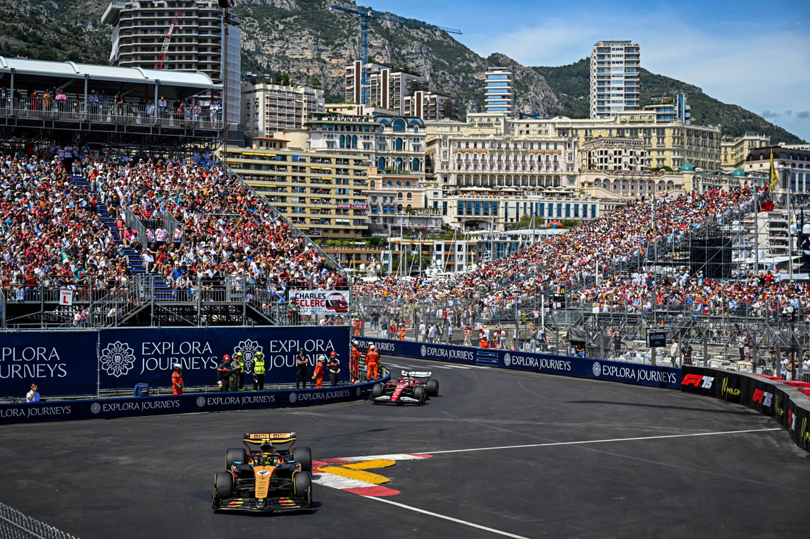
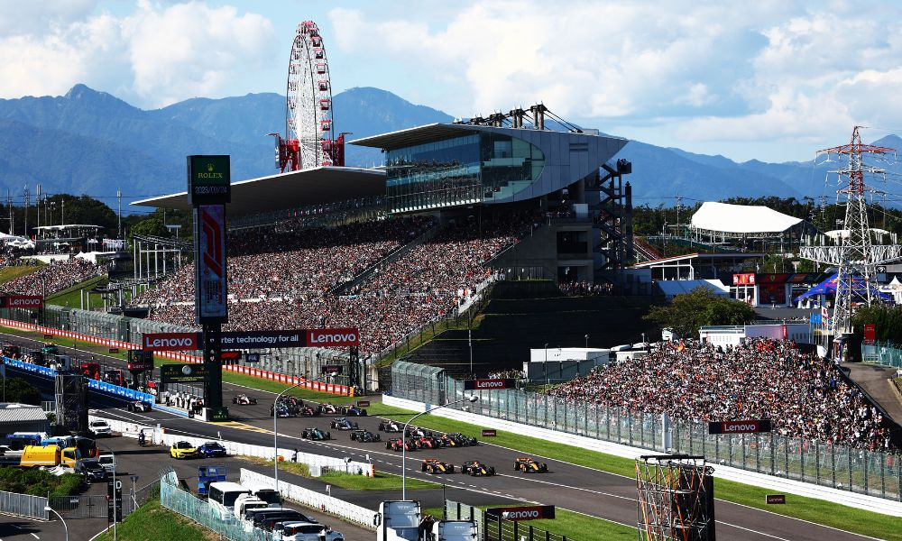
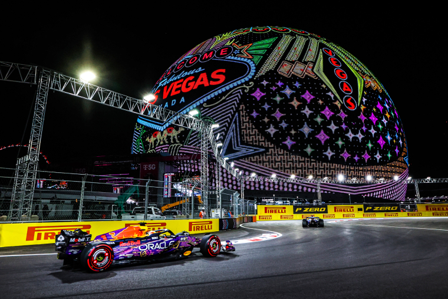

---

As someone who loves watching Formula 1, I wanted to make an interactive map that displayed all of the racetracks and street circuits that F1 currently races at (2026), so here it is!

```{r}

# read in packages
library(tidyverse)
library(leaflet)

# created a manual data frame for all of the F1 racetracks 
f1_tracks <- data.frame(

# listed all of the racetracks 
  Track = c("Albert Park Circuit", "Shanghai International Circuit", "Suzuka Circuit", "Miami International Autodrome", "Circuit Gilles Villeneuve", "Circuit de Monaco", "Circuit de Barcelona-Catalunya", "Red Bull Ring", "Silverstone Circuit", "Circuit de Spa-Francorchamps", "Hungaroring", "Circuit Zandvoort", "Monza Circuit", "Madring", "Baku City Circuit", "Marina Bay Street Circuit", "Circuit of the Americas", "Autodromo Hermanos Rodriguez", "Interlagos Circuit", "Las Vegas Strip Circuit", "Lusail International Circuit", "Yas Marina Circuit"),

# listed all of the host cities
City = c("Melbourne, Australia", "Shanghai, China", "Suzuka, Japan", "Miami Gardens, U.S.", "Montreal, Canada", "Monte Carlo, Monaco", "Montmelo, Spain", "Spielberg, Austria", "Silverstone, U.K.", "Stavelot, Belgium", "Mogyorod, Hungary", "Zandvoort, Netherlands", "Monza, Italy", "Madrid, Spain", "Baku, Azerbaijan", "Singapore", "Austin, U.S.", "Mexico City, Mexico", "Sao Paulo, Brazil", "Paradise, U.S.", "Lusail, Qatar", "Abu Dhabu, UAE"),

# listed all of the latitudes for each race
Latitude = c(-37.849, 31.338, 34.843, 25.958, 45.5, 43.734, 41.57, 47.219, 52.078, 50.437, 47.582, 52.388, 45.615, 40.466, 40.372, 1.291, 30.132, 19.404, -23.703, 36.114, 25.490, 24.467), 

# listed all of the longitudes for each race
Longitude = c(144.968, 121.221, 136.533, -80.238, -73.522, 7.42, 2.261, 14.764, -1.016, 5.971, 19.248, 4.544, 9.281, -3.616, 49.853, 103.864, -97.641, -99.09, -46.699, -115.172, 51.454, 54.603))

# customized pin icon and color
pin <- awesomeIcons(icon = "flag-checkered", library = "fa",     markerColor = "red", iconColor = "#FFFFFF", extraClasses = "fa-inverse")

# base layer: interactive map with f1_tracks data frame
leaflet(data = f1_tracks) %>%
# added satellite map background  
  addProviderTiles(providers$Esri.WorldImagery) %>%
# pinned racetracks  
  addAwesomeMarkers(
# pinpointed coordinates using longitude and latitude values    
    ~Longitude, ~Latitude, 
# set icon as pin object that was customized earlier    
    icon = pin,
# labeled each pin with track and city names    
    popup = ~paste("<b>", Track, "</b><br>", City))

```

---

## Some Notable Tracks

::: {layout="[[1, 1, 1]]"}






:::